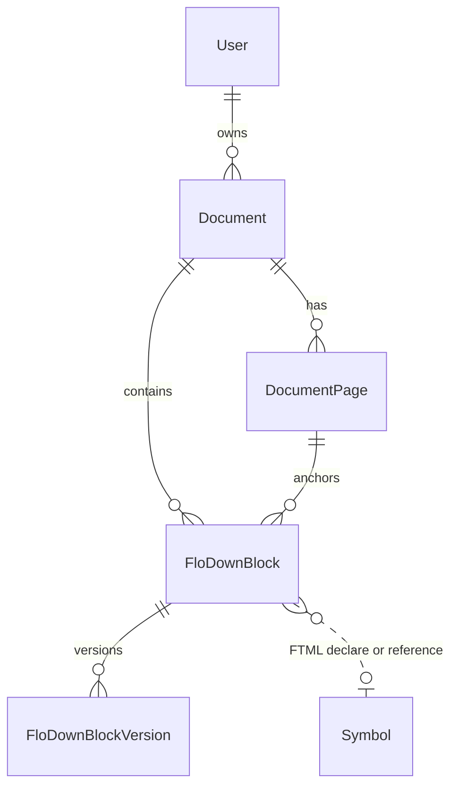

# GloX domain entities

How GloX stores curated FloDown blocks, symbols, and FTML semantics.

**Sources:** FloDown types in [`public/flodown/flodown.d.ts`](public/flodown/flodown.d.ts); database in [`prisma/schema.prisma`](prisma/schema.prisma).

---

## Naming layers

GloX uses three vocabularies. Do not conflate them.

| Layer | Example names | Meaning |
|-------|---------------|---------|
| **FloDown runtime** | `addElement(FloDownBlock)`, `addSymbolDeclaration`, `{ type: "definition" \| "paragraph" }` | WASM API and FTML block shapes |
| **Prisma / DB** | `FloDownBlock`, `FloDownBlockVersion`, `FloDownBlockStatus` | Persisted curation rows |
| **App code** | `floDownBlock`, `ExtractedItem`, `FtmlBlock`, `ExtractBlockType` | API, UI, and server functions |

FloDown also has a document-tree type called **`LogicalParagraph`** in `flodown.d.ts`. That is **not** the GloX DB entity name.

**Page text highlights** use `extract` vs `reference` (extracted block text vs mark reference).

---

## Core idea

1. Curators extract text from PDF pages into **`FloDownBlock`** rows.
2. Each row stores FTML in **`statement`** — usually a single top-level `{ type: "definition" }` or `{ type: "paragraph" }` block.
3. Block shape is determined by **`statement.type`**, not a separate DB column.
4. Inline semantics use **`definiendum`** (define/introduce) and **`symref`** (reference only).
5. Local symbols live in the **`Symbol`** table; MathHub concepts use full URLs in FTML `uri` fields.

The source of truth for inline semantics is `FloDownBlock.statement`. Legacy tables `SymbolicReference` and `DefinitionSymbolicRef` remain in the schema but are unused.

---

## Block types (extract UI)

When creating content, the extract dialog offers two block types (see [`src/types/blockType.ts`](src/types/blockType.ts)):

| `ExtractBlockType` | FTML `statement` shape | Definiendum editing |
|--------------------|------------------------|---------------------|
| `definition` | `{ type: "definition", for_symbols, content: [{ type: "paragraph", … }] }` | Yes |
| `paragraph` | `{ type: "paragraph", content: [...] }` | No (symref only) |

At export/preview, blocks are passed to FloDown via **`addElement()`** and symbols via **`addSymbolDeclaration()`**.

---

## File identity

Module location shared by `FloDownBlock`, `Symbol`, and `LatexTable` export:

| Field | Example |
|-------|---------|
| `futureRepo` | `smglom/softeng` |
| `filePath` | `mod` |
| `fileName` | `Software` |
| `language` | `en` |

`Document` stores `futureRepo`, `filePath`, and `language` (not `fileName`). Rows with the same identity export as one sTeX module.

---

## Database entities

### User

Roles: `ADMIN`, `CURATOR`, `EXTRACTOR`. Owns documents; audits FloDown block edits.

### Document

Uploaded PDF (or similar): pages, FloDown blocks, mark references, LaTeX export, LLM suggestions. `indexStatus` tracks mark-reference workflow (`EXTRACTED`, …) and is set when the first mark reference is created.

### DocumentPage

One page of extracted text. Anchors FloDown blocks and mark references.

### FloDownBlock

Curated content row: provenance + FTML `statement`.

| Field | Role |
|-------|------|
| `originalText` | Plain extracted text |
| `statement` | FTML JSON (`FtmlBlock` / `FtmlStatement`) |
| `status` | `EXTRACTED` → `FINALIZED_IN_FILE` → `SUBMITTED_TO_MATHHUB`, or `DISCARDED` |
| File identity fields | Export target module |
| `currentVersion` / `versionHistory` | Edit snapshots (`FloDownBlockVersion`) |

App DTOs: **`ExtractedItem`** (list/edit flows), **`FloDownBlockSemantic`** (semantic panel: `id`, `statement`).

### Symbol

Local symbol catalog. Unique per `(symbolName, futureRepo, filePath, fileName, language)`.

- **Declared** via `definiendum` with `symdecl: true` or `for_symbols`
- **Referenced** via `symref` or `definiendum` with `symdecl: false`
- Delete blocked while declaring FloDown blocks still exist in the same file identity

### MarkReference

Per-page symbol index entry (`symbolName` + verbalization). Available on any document. Separate from FTML `symref`.

### LatexTable

Generated sTeX and history per document + file identity.

### FloDownBlockVersion

Snapshot of `statement` and `originalText` after each edit.

### LLM artifacts

`LlmSuggestion`, `LlmSuggestedDefinition`, `LlmSuggestedDefinienda` — advisory; accepted output is written to `statement`.

### Legacy (schema only)

`SymbolicReference`, `DefinitionSymbolicRef` — deprecated, not used by app code.

---

## FTML (`statement`)

FloDown-shaped JSON on each `FloDownBlock`. Top-level block type:

| `statement.type` | sTeX export (current) |
|------------------|------------------------|
| `definition` | `\begin{sdefinition}...\end{sdefinition}` |
| `paragraph` | Plain text with inline `\sr{}` / `\definiendum{}` |

**Definition** example:

```json
{
  "type": "definition",
  "for_symbols": ["monoid"],
  "content": [
    {
      "type": "paragraph",
      "content": [
        "A ",
        { "type": "definiendum", "uri": "monoid", "content": ["monoid"], "symdecl": true },
        " is a set with a binary operation."
      ]
    }
  ]
}
```

**Paragraph** example:

```json
{
  "type": "paragraph",
  "content": [
    "See also ",
    { "type": "symref", "uri": "monoid", "content": ["monoid"] },
    " for context."
  ]
}
```

Types are defined in [`src/types/ftml.types.ts`](src/types/ftml.types.ts) (`FtmlBlock`, `DefinitionNode`, `ParagraphNode`, …).

### Inline nodes

| Node | FloDown | GloX notes |
|------|---------|------------|
| `symref` | `{ type, uri, content }` | Reference to local or MathHub symbol; `content` is verbalization |
| `definiendum` | `{ type, uri, content }` | Plus **`symdecl`**: `true` = declare local symbol; `false` = reference only |
| `definiens` | `{ type, uri, content }` | In ontology; rarely created in UI |

### Symbol URIs

| Source | `uri` in FTML | Resolution |
|--------|---------------|------------|
| Local DB | Short name, e.g. `"monoid"` | Via row file identity + `Symbol` table |
| MathHub | Full URL | Stored verbatim |

Local names expand at sTeX export to MathHub-style URLs using the exporting module's file identity.

---

## Key rules

| Topic | Rule |
|-------|------|
| Symbol uniqueness | One `Symbol` row per name per file identity |
| Deleting a declaring block | Strips matching symrefs from other rows; impact preview shown first |
| Path / repo move | Updates FloDown block and symbol file identity; does not rewrite local URIs inside FTML |
| Curation status | `EXTRACTED` → `FINALIZED_IN_FILE` → `SUBMITTED_TO_MATHHUB` or `DISCARDED` |

---

## Relationships



---

## In-memory types (not DB)

**`UnifiedSymbolicReference`** — choice when linking a symref in the UI:

```ts
{ source: "MATHHUB", uri: "https://mathhub.info?..." }
// or
{ source: "DB", symbolName, futureRepo, filePath, fileName, language }
```

Only the resolved `SymbolUri` is written into FTML for local symbols.

---

## Glossary

| Term | Meaning |
|------|---------|
| **FloDownBlock** | DB row: curated content + `statement` JSON passed to `addElement()` at export |
| **FtmlBlock** | TypeScript type for one FTML block in `statement` |
| **ExtractBlockType** | UI-only: `definition` or `paragraph` when creating a new row |
| **Extract** | Highlight/source term for extracted block text on a PDF page |
| **Mark reference** | Per-page symbol verbalization index (not FTML `symref`) |
| **statement** | FTML JSON on a FloDown block |
| **symdecl** | GloX-only flag on `definiendum`: declare vs reference |
| **for_symbols** | Declared symbol URIs on the FTML `definition` block |
| **Sniffy** | Automatic symref suggestion tool |
