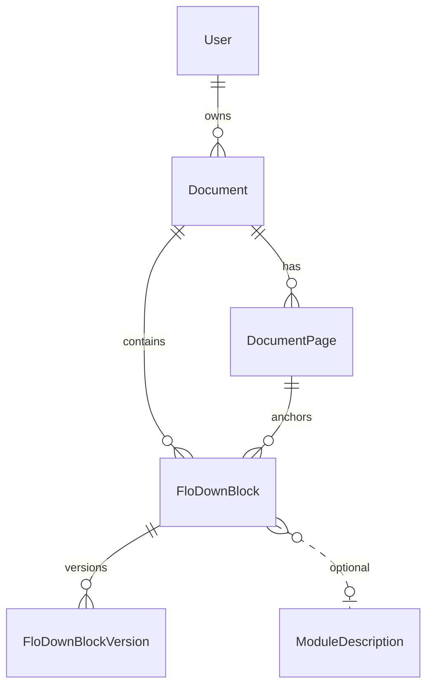

# SDD: FloDown block lifecycle

## Domain context

Owns creation, versioning, cascade deletion of symrefs, status management, and export identity for
FloDown blocks — the curated FTML content unit.

**Sources of truth:** `prisma/schema.prisma` (persistence); FTML inline semantics on
`FloDownBlock.statement` (not legacy `SymbolicReference` / `DefinitionSymbolicRef` tables).

Out of scope (sibling specs):

- Symbol registry and propagation — `symbols-semantics/` SDDs
- sTeX export pipeline — `curation-export/stex-export.md`
- FTML statement shapes — [`ftml.md`](../../external-deps/libraries/ftml.md)

### Naming layers

Do not conflate these vocabularies:

| Layer | Examples | Meaning |
| --- | --- | --- |
| **FloDown runtime** | `addElement`, `addSymbolDeclaration`, `{ type: "definition" }` | WASM API and FTML block shapes |
| **Prisma / DB** | `FloDownBlock`, `FloDownBlockVersion`, `FloDownBlockStatus` | Persisted curation rows |
| **App code** | `floDownBlock`, `ExtractedItem`, `FtmlBlock`, `ExtractBlockType` | API, UI, and server functions |

Page text highlights use **extract** (curated block text) vs **mark reference** (index mention) —
see [`documents-extraction`](../../../prds/domains/documents-extraction.md).

### Entity relationships

**Sibling entities** (other PRDs): `MarkReference` and `LatexTable` on `Document`;
`LlmSuggestion` artifacts are advisory — accepted output is written to `statement`.

## Architecture boundaries

| Layer | Responsibility |
| --- | --- |
| `src/serverFns/extractFloDownBlock.server.ts` | Creates a FloDown block from selected text with initial statement and version 1. |
| `src/serverFns/updateFloDownBlock.server.ts` | Updates statement text, increments version, appends `FloDownBlockVersion` row. |
| `src/serverFns/deleteFloDownBlock.server.ts` | Deletes block; invokes symref cleanup across sibling blocks. |
| `src/server/floDownBlockDeletion.ts` | Computes declared symbol URIs and removes matching symrefs from other statements transactionally. |
| `src/serverFns/floDownBlockStatus.server.ts` | Updates FloDown block status; bulk status by export identity. |
| `src/serverFns/floDownBlockAggregate.server.ts` | Combines statements for LaTeX/sTeX export. |
| `src/serverFns/documentLocation.server.ts` | Moves document export identity and applies client-supplied opaque symbol URI replacements. |
| `prisma/schema.prisma` `FloDownBlock` | Authoritative storage for statement JSON, `declaredSymbolsInfo`, status, and export identity. |

## Data contracts

| Enum | Values |
| --- | --- |
| `FloDownBlockStatus` | `DISCARDED`, `EXTRACTED`, `FINALIZED_IN_FILE`, `SUBMITTED_TO_MATHHUB` |

| Field | Type | Notes |
| --- | --- | --- |
| `statement` | JSON (FTML) | `definition` or `paragraph` per `statement.type`. Local `uri` values are opaque FloDown symbol URIs after cutover (D-FTML-01 superseded). On persist, definition `for_symbols` is written as `[]`; FloDown still needs the key at `addElement` (rewrite fills it). |
| `declaredSymbolsInfo` | JSON array | Declaration records this block **declares** (E-FTML-06 / D-FTML-04). Persist MUST NOT copy importing definienda into this list. |
| `declaredSymbols` | `string[]` | **Deprecated.** Unused by application code; retained for existing rows. |
| `currentVersion` | int | Incremented on each edit |
| Export identity | `futureRepo`, `filePath`, `fileName`, `language` | Set at creation from Document or module context |

`Document` stores `futureRepo`, `filePath`, and `language` only (no `fileName`). Rows sharing the
same four-field identity on FloDown blocks export as one sTeX module.

### App DTOs (not DB)

| Type | Role |
| --- | --- |
| `ExtractedItem` | List/edit flows — see `src/server/text-selection.ts` |
| `FloDownBlockSemantic` | Semantic panel — `id`, `statement` — see `src/types/Semantic.types.ts` |
| `UnifiedSymbolicReference` | Symref picker value before URI is written to FTML — see `SymbolicRef.types.ts` |

## Business rules

### Creation & versioning

**S-FDB-01 (Event-Driven):** WHEN `createFloDownBlock` succeeds, the system MUST persist
`originalText`, `statement`, `declaredSymbolsInfo` (possibly empty), and a `FloDownBlockVersion` at
version 1.

**Upstream:** R-FDB-01

**S-FDB-02 (Event-Driven):** WHEN `updateFloDownBlock` succeeds, the system MUST increment
`currentVersion` and MUST insert a version history row with the editor's user ID.

**Upstream:** R-FDB-02

### Deletion & symref cascade

**S-FDB-03 (Event-Driven):** WHEN a FloDown block is deleted, the system MUST remove symrefs whose
`uri` exactly equals any `symbolUri` from that block’s `declaredSymbolsInfo` from remaining
statements in the same transaction.

**Upstream:** R-FDB-03

### Status & export identity

**S-FDB-04 (State-Driven):** WHILE status is `DISCARDED`, curation list queries MUST filter
discarded blocks unless explicitly including them.

**Upstream:** R-FDB-04

**S-FDB-05 (Event-Driven):** WHEN moving blocks to a target export identity, IF existing blocks at
that identity have a different status, the system MUST abort and return a conflict error.

**Upstream:** R-FDB-05

**S-FDB-06 (Ubiquitous):** Every FloDown block MUST store all four export identity fields.

**Upstream:** R-FDB-06

**S-FDB-06a (Event-Driven):** WHEN a Document or block export-identity move succeeds, the system
MUST update identity columns and MUST apply S-SYM-10 for every declaration on the moved blocks.
The system MUST NOT leave previous local symbol URIs in statements.

**Upstream:** R-SYM-16, R-DOC-07, R-DOC-08

**S-FDB-09 (Ubiquitous):** Statement persist MUST NOT rewrite a symbol `uri` that is already an
HTTP(S) string into a short name.

**Upstream:** R-SYM-01, R-SYM-18

### Access control

**S-FDB-07 (Ubiquitous):** All FloDown block mutations MUST require an authenticated session.

**Upstream:** R-FDB-07

**S-FDB-08 (Ubiquitous):** FloDown block mutations tied to a Document MUST verify the caller owns
that Document or holds Admin role before proceeding.

**Upstream:** R-FDB-08 — **not fully implemented** (see BUG-001 in auth SDD).

## Test mapping

| SDD rule | PRD rule | Test |
| --- | --- | --- |
| S-FDB-01 | R-FDB-01 | Gap |
| S-FDB-02 | R-FDB-02 | Gap |
| S-FDB-03 | R-FDB-03 | Gap |
| S-FDB-04 | R-FDB-04 | Gap |
| S-FDB-05 | R-FDB-05 | Gap |
| S-FDB-06 | R-FDB-06 | Gap |
| S-FDB-06a | R-SYM-16, R-DOC-07, R-DOC-08 | `declaredSymbolsInfo.test.ts` opaque replace |
| S-FDB-07 | R-FDB-07 | Gap |
| S-FDB-08 | R-FDB-08 | Gap |
| S-FDB-09 | R-SYM-18 | `prepareFloDownStatement.test.ts` |

## Open documentation gaps

- Module-description-scoped block ownership rules — `moduleDescription.server.ts` uses separate
  auth helper; not yet traced to SDD rules.
- `updateFloDownBlockAst` semantic edit path — same ownership gap as BUG-001.

## Related docs

- [`../../decisions/flodown-persist-and-boundary.md`](../../decisions/flodown-persist-and-boundary.md)
- [`flodown-blocks.md`](../../../prds/domains/flodown-blocks.md)
- [`../../external-deps/libraries/ftml.md`](../../external-deps/libraries/ftml.md)
- [`../auth/auth-sessions.md`](../auth/auth-sessions.md)
- [`../documents-extraction/upload-and-ownership.md`](../documents-extraction/upload-and-ownership.md) — Document entity, location moves
