---
canonical_for:
  - knowledge-graph-node-kinds
  - spec-upstream-traceability
  - pure-function-audit
informed_by:
  - /specs/ai-native-development-architecture.md
  - /specs/engineering/spec-authoring.md
  - /other_docs/prd-sdd-boundary-rationale.md
see_also:
  - /specs/traced-knowledge-graph.md
  - /specs/DEVELOPER_GUIDE.md
  - /specs/review/REVIEW_GUIDE.md
  - /specs/review/TESTING_GUIDE.md
  - /specs/product/README.md
  - /specs/prds/README.md
  - /specs/engineering/decisions/README.md
  - /specs/engineering/external-deps/README.md
  - /specs/engineering/deployment/README.md
  - /specs/organization/organization.md
  - /AGENTS.md
  - /.cursor/skills/frontend-skill/SKILL.md
  - /.cursor/skills/backend-skill/SKILL.md
---

# Traced knowledge graph

> **Status: canonical companion** to
> [ai-native-development-architecture.md](./ai-native-development-architecture.md). Names **node kinds**
> and **edges** in GloX's organizational knowledge graph. Does **not** supersede architecture for
> workflow, layers, or git policy. Does **not** create binding product or compliance contracts —
> those remain PRDs and SDDs.

**Working name:** traced knowledge graph (alias: docs-as-contracts megamodel). No rename until the
model stabilizes ([§4.4](#44-house-name)).

**Why this note exists:** Specs are knowledge management — externalizing what lives in PM/eng heads
so humans and agents share durable context ([architecture §1](./ai-native-development-architecture.md),
[§7 Dark Matter](./ai-native-development-architecture.md#7-capturing-dark-matter-tribal-knowledge)).
The folders already encode a graph; this doc names the **node types** and **edges** explicitly.

Industry cousins (not prescriptions): OMG MDA (CIM→PIM→PSM), Twin Peaks (requirements ↔ architecture
co-evolve), megamodels / model management, requirements traceability, ADRs / design rationale,
architecturally significant requirements (ASRs), organizational memory.

---

## 0. Core claim: nothing is a pure function of its upstream

Ask of every edge: **Does this node follow *only* from its listed upstream nodes?**

**Short answer for the motivating case:** Is `product docs = f(engagement signals)`? **No.**
Engagement is one input. Strategy, founder intent, partner GTM, competitive landscape, capacity,
and prior product docs also write the brief. An agent (or PM) given only dashboards invents a
roadmap.

### 0.1 Pure-function audit (major nodes)

| Claim | Pure? | Missing inputs (name them or agents invent them) |
| --- | --- | --- |
| Product docs = f(engagement) | **No** | Strategy/vision, founder–CEO intent, partner GTM, competitive intel, capacity/roadmap constraints, prior product docs, finance unit-economics goals |
| PRD = f(product) | **No** | Legal/compliance regimes, partner contracts, incidents/postmortems, CEO/finance locks, existing PRDs, dictionary |
| ADR = f(PRD) | **No** | Platform options, cost/latency, external facts, incidents, prior decisions, eng taste / reversibility |
| Ops facts = f(code) | **No** | Cloud vendor consoles, secret locations, LD projects, partner runbooks, on-call tribal knowledge |
| SDD = f(PRD, decision, ops) | **No** | Platform architecture, schema, sibling systems, prior SDDs, flags, threat baselines |
| Code = f(SDD) | **No** | Platform, schema, style guides, Figma/brand, a11y, i18n, precedent code, siblings, live APIs, lint/CI, deps |
| Tests = f(SDD) | **No** | Trophy policy, harness (`USE_MOCKS`), fixtures, CI budgets, precedent tests |
| Deploy = f(code) | **No** | Ops/runbooks, env/secrets, flags, tenant matrix, release policy |
| Running app = f(deploy) | **No** | Traffic, data state, third-party outages, flag evaluations, user behavior |
| Engagement = f(app) | **No** | Instrumentation taxonomy, support process, sales/CS notes, market events, sampling bias |

When a node is missing, agents (and humans under time pressure) **still produce output**: they infer,
hallucinate, or silently choose defaults. Those choices are *real knowledge* — tribal until named.

**Implication:** the graph’s job is **making every non-derivable input an explicit node**
(documented, linked, or deliberately “infer from X”).

---

## 1. Node kinds

### 1.1 Orientation & learning — why product ≠ f(engagement)

| Kind | Location (typical) | What it captures | If missing… |
| --- | --- | --- | --- |
| **Engagement signals** | metrics, support, [`product/feedback.md`](./product/feedback.md) | What users/partners did and said | Product invents pain from anecdotes only |
| **Strategy / vision** | Product briefs (`glox.md` Vision), FAUstairs / research narrative | Where we choose to play | Roadmap becomes a ticket dump |
| **Founder / CEO / PM intent** | Meetings, Clarify, org accountability | Non-negotiable bets not yet in metrics | Agents optimize local engagement against strategy |
| **Research / academic context** | FAU module catalog, MathHub integration goals | How extraction feeds assessment | Product assumes PDF-only world |
| **Competitive / market intel** | Occasional product notes; mostly tribal | Alternatives users compare us to | Build features already table-stakes elsewhere |
| **Capacity & portfolio constraints** | Org, hiring, “two products” boundary | What we can staff this quarter | Infinite roadmap |
| **Finance / unit-economics goals** | Clarify Accepted tradeoffs; CEO locks | COGS, margin, rev-share targets | Cost dials with no owner |
| **Prior product docs** | `/specs/product/` history | Continuity of inventory & positioning | Contradict shipped-feature inventory |
| **Product orientation** | `/specs/product/` | Vision, roadmap, shipped inventory | — (this is the output node) |

### 1.2 Problem-side contracts — why PRD ≠ f(product)

| Kind | Location (typical) | What it captures | If missing… |
| --- | --- | --- | --- |
| **Domain dictionary** | `/specs/meta/domain-dictionary.yaml` | Preferred labels | Synonym drift; agent invents “Privacy Pro” |
| **Legal / vendor contracts** | `/specs/engineering/external-deps/vendors/`, counsel | ZDR, DPA, residency | PRD guesses compliance; decisions/ops go stale |
| **Regulation / certification regimes** | Compliance PRDs, SOC2 notes | External law-like obligations | Under-bind security |
| **Incidents / postmortems** | [`organization/incidents/`](./organization/incidents/) | What already hurt us | Repeat the same Binding gap |
| **CEO / finance locks** | Clarify; commercial open questions | Named MUST (price, margin, promise) | Eng treats preference as Binding |
| **Prior / sibling PRDs** | `/specs/prds/` | DRY; closed exception lists | Duplicate or contradict R-IDs |
| **PRD — user / storefront promises** | domains + commercial Product | Teachable outcomes | — |
| **PRD — compliance / commercial obligations** | compliance + commercial | Silent incident classes | — |

### 1.3 Decisions & world facts — why decisions/ops ≠ f(PRD)

| Kind | Location (typical) | What it captures | If missing… |
| --- | --- | --- | --- |
| **Engineering decisions** | `/specs/engineering/decisions/<slug>.md` (`D-<AREA>-<NN>`) | Chosen tradeoff + why | Silent undo of hard choices |
| **External facts** | `/specs/engineering/external-deps/` (`E-<AREA>-<NN>`) | ZDR, library quirks — world facts, not choices | Agents invent provider posture |
| **Deployment facts** | `/specs/engineering/deployment/` | ClickOps, secrets, LD, deploy topology | Agents hallucinate infra ([§7](./ai-native-development-architecture.md#7-capturing-dark-matter-tribal-knowledge)) |
| **Feature flags / experimentation** | LD docs + console | Gating independent of “always on” SDD | Ship ungated or invent flag keys |
| **Release / tenant matrix** | release runbook, tenant deploys | Which tenant/region gets what | Wrong-tenant assumptions |
| **On-call / runbook lore** | Partial in ops; rest tribal | What breaks at 2am | Docs that ignore production |

### 1.4 Solution policy — why SDD ≠ f(PRD, decision, ops)

| Kind | Location (typical) | What it captures | If missing… |
| --- | --- | --- | --- |
| **Application platform architecture** | `AGENTS.md`, Nx, `package.json` | TanStack Start/Prisma/Postgres/MUI/tenant-per-DB | Wrong stack assumptions in SDD |
| **Data model / schema standards** | `schema.prisma`, [`database-standards.md`](./engineering/database-standards.md) | Tables, indexes, tenancy | SDD invents fields that can’t exist |
| **Sibling systems** | ml-backend, subscription-server | Cross-repo contracts | SDD assumes all logic is in-app |
| **Prior SDDs / topic indexes** | `features/**`, `index.md` | Precedence, ownership splits | Overlap and path-ID confusion |
| **Threat / abuse baselines** | Compliance + eng practice | Default deny beyond one feature | Soft SDD on logging/auth |
| **SDD — solution policy** | `/specs/engineering/features/` | Boundaries, contracts, EARS for this stack | — |
| **Process / change deltas** | `/specs/changes/` | In-flight Clarify→Archive | — |
| **Guides / accountability** | DEVELOPER_GUIDE, REVIEW_GUIDE, org | How to author/review; RACI | — |

### 1.5 Implementation inputs — why code ≠ f(SDD)

| Kind | Location (typical) | What it captures | If missing, agents… |
| --- | --- | --- | --- |
| **Implementation style guides** | frontend/backend skills, composition / React BP skills | Idioms for this codebase | Tutorial-generic code |
| **UI / visual design specs** | Figma (external), brand tokens, `styles/` | Spatial/visual intent | Invent UI; ignore brand |
| **Accessibility & UX baselines** | web-design-guidelines; WCAG expectations | a11y / interaction baselines | Inaccessible UI |
| **i18n / copy / content** | locales, copy decks, partner strings | User-visible language | Wrong locale/brand |
| **Existing codebase (precedent)** | Neighbor modules | Chesterton fences, local patterns | “Clean rewrite” breaks quirks |
| **External API schemas (live)** | MCP / SDKs | Vendor shapes that Markdown rots | Guess payloads |
| **Executable lint / type / CI gates** | ESLint, `tsc`, husky, `specs:check-*` | Mechanical house rules | Style drift; CI surprise |
| **Test harness & Trophy policy** | TESTING_GUIDE, Playwright, `USE_MOCKS` | Where/how to test | Wrong-layer tests |
| **Dependency & supply-chain policy** | package.json, pnpm overrides | Allowed libs / pins | Random dependencies |
| **Human review judgment** | Reviewers + [`organization.md`](./organization/organization.md) | Classification & taste | Confident wrong Binding/Product |

### 1.6 Executable & runtime

| Kind | Location (typical) | What it captures | Binding? |
| --- | --- | --- | --- |
| **Tests** | app tests; SDD Test mapping | Executable checks | Executable contract |
| **Code** | `apps/`, `libs/` | Algorithms, tuning, wiring | Runtime truth |
| **Deployment / config** | Cloud Run, env, secrets, LD | Tenant deploys | Production wiring |
| **Running system** | Prod/stage | Live behavior + data + traffic | Production reality |
| **Instrumentation taxonomy** | analytics events, Sentry scrubbing rules | *What* we measure (shapes engagement) | Often tribal — biases learning |

### Notes on blurry bands

- **Product vs engagement:** engagement *informs* product; it does not *author* strategy.
- **Decisions as ASRs:** thin external obligation → PRD; chosen tradeoff → `D-*` decision file (Twin Peaks).
- **Opaque dials** → SDD/code; business goal → Clarify/finance — not automatic PRD Binding.
- **Figma vs style vs SDD:** visual intent ≠ implementation idiom ≠ behavioral policy.
- **Instrumentation** sits upstream of engagement: what you don’t measure won’t appear as “user need.”

---

## 2. Flow graph

Dashed edges = often implicit (infer or invent). Focus: every major node has multiple parents.

```mermaid
flowchart TB
  subgraph learn["Learning — engagement ≠ whole story"]
    INST["Instrumentation taxonomy"]
    ENG["Engagement signals"]
    MKT["Market / competitive events"]
    SUP["Support / CS / sales notes"]
  end

  subgraph strategy["Strategy inputs to product"]
    VIS["Strategy / vision"]
    INTENT["Founder · CEO · PM intent"]
    GTM["Partner / GTM motion"]
    CAP["Capacity / portfolio limits"]
    FIN["Finance / unit-economics goals"]
    PPROD["Prior product docs"]
  end

  subgraph orient["Orientation"]
    PROD["Product docs"]
    DICT["Domain dictionary"]
  end

  subgraph problem["Problem-side"]
    PRD_U["PRD — user / storefront"]
    PRD_C["PRD — compliance / commercial"]
    LEGAL["Legal / vendor contracts"]
    REG["Regulation / certification"]
    INC["Incidents / postmortems"]
    LOCK["CEO / finance locks"]
  end

  subgraph decision["Decisions & world"]
    DEC["Engineering decisions (D-*)"]
    OPS["Operations facts"]
    FLAGS["Feature flags / LD"]
    REL["Release / tenant matrix"]
  end

  subgraph solution["Solution policy"]
    SDD["SDD"]
    PLAT["Platform architecture"]
    SCHEMA["Data model / DB standards"]
    SIB["Sibling systems"]
  end

  subgraph impl["Implementation inputs"]
    STYLE["Style guides"]
    FIGMA["Figma / brand"]
    A11Y["a11y / UX"]
    I18N["i18n / copy"]
    PREV["Codebase precedent"]
    MCP["Live API schemas"]
    LINT["Lint / CI"]
    HARNESS["Test harness / Trophy"]
    DEPS["Deps policy"]
    HUMAN["Human judgment"]
  end

  subgraph exe["Executable & runtime"]
    TEST["Tests"]
    CODE["Code"]
    DEP["Deployment / config"]
    APP["Running application"]
  end

  APP --> INST
  APP --> ENG
  INST --> ENG
  SUP --> ENG
  MKT -.-> ENG

  ENG --> PROD
  VIS --> PROD
  INTENT --> PROD
  GTM --> PROD
  CAP --> PROD
  FIN --> PROD
  PPROD --> PROD

  PROD --> PRD_U
  PROD --> PRD_C
  LEGAL --> PRD_C
  REG --> PRD_C
  INC --> PRD_C
  INC --> DEC
  LOCK --> PRD_C
  LOCK --> FIN
  DICT --> PRD_U
  DICT --> PRD_C
  DICT --> SDD

  PRD_U --> SDD
  PRD_C --> SDD
  PRD_C --> DEC
  DEC --> SDD
  OPS --> SDD
  OPS --> FLAGS
  OPS --> REL
  FLAGS --> SDD
  FLAGS --> DEP
  REL --> DEP
  PLAT --> SDD
  SCHEMA --> SDD
  SIB --> SDD

  SDD --> TEST
  SDD --> CODE
  HARNESS --> TEST
  PLAT --> CODE
  SCHEMA --> CODE
  STYLE --> CODE
  FIGMA -.-> CODE
  A11Y -.-> CODE
  I18N --> CODE
  PREV --> CODE
  SIB --> CODE
  MCP --> CODE
  LINT --> CODE
  DEPS --> CODE
  HUMAN --> PROD
  HUMAN --> PRD_U
  HUMAN --> SDD
  HUMAN --> CODE
  TEST --> CODE

  OPS --> DEP
  CODE --> DEP
  DEP --> APP
```

### Compact reading

1. **Engagement** is necessary but not sufficient for **product** — strategy, GTM, capacity, finance, intent, and prior docs also write it.
2. **PRDs** add legal, regulation, incidents, locks — not only product briefs.
3. **SDD** still needs platform, schema, siblings, flags.
4. **Code/tests** need the implementation band (style, design, precedent, lint, harness…).
5. **App → instrumentation → engagement** closes the loop; bad instrumentation biases product.

---

## 3. Worked examples

### 3.1 Product ≠ f(engagement)

“Partner Secure attach rate flat” (engagement) does **not** alone imply the next product doc line.
Also required: partner GTM (who sells Privacy+), finance (rev-share), capacity (can we staff PIN UX),
strategy (Endpoint vs SaaS priority), prior inventory (feature already exists but undiscoverable).

### 3.2 Code ≠ f(SDD) — “Secure settings toggle”

| Node | Example |
| --- | --- |
| PRD | PIN before unlock |
| SDD | Gate ownership; `needsPinSetup` |
| Platform / style / Figma / precedent / tests | As before — still required |

---

## 4. Resolved policy

Decisions below are binding for **how we author and traverse** specs. They do not add product MUST
rules — see [spec-authoring.md](./engineering/spec-authoring.md) for EARS and templates.

### 4.1 Classifier vs node kinds

**Orthogonal concerns:**

| Mechanism | Answers | Where |
| --- | --- | --- |
| **Two-filter classifier** | *Where does this rule live?* — PRD Product, PRD Binding, or SDD | [spec-authoring §7](./engineering/spec-authoring.md#what-belongs-in-prd-sdd-and-code) |
| **Node kinds** (§1) | *What type of knowledge is this artifact?* — for graph traversal and Clarify upstream audits | This doc |

A PRD Binding rule is an `R-*` atom **and** a compliance-obligation node. An SDD is solution policy
**and** may cite `D-*` / `E-*` / deployment parent nodes in `**Upstream:**` lines.

### 4.2 ASR in a decision that is also a sold promise

**Always** add a thin PRD parent (Product or Binding, per the two-filter) stating the
customer-visible outcome. The `D-*` atom records the engineering tradeoff only. Sold language MUST
NOT live only in [`engineering/decisions/`](./engineering/decisions/) (Twin Peaks: requirements and
architecture co-evolve).

### 4.3 OPSX deltas: overlays, not permanent nodes

Work-in-flight under [`/specs/changes/`](./changes/) is an **overlay** on the graph — Clarify,
proposal, design, tasks. It is **not** a permanent node kind. **Archive** folds deltas into canonical
PRD, SDD, and decision nodes.

### 4.4 House name

Working name: **traced knowledge graph**. Alias: **docs-as-contracts megamodel**. No rename until
the model stabilizes.

### 4.5 Durable doc vs infer-from-repo vs external

| Class | Examples | Agent rule |
| --- | --- | --- |
| **Durable doc** | PRDs, SDDs, `D-*`, `E-*`, deployment, incidents, product briefs, dictionary | Read and link; do not invent |
| **Infer from repo** | `schema.prisma`, `package.json`, ESLint/`tsc`, `pnpm-workspace.yaml` overrides, neighbor modules | Traverse `code` frontmatter; read live files |
| **External** | Figma, counsel/DPA PDFs, vendor consoles, live MCP/OpenAPI schemas | Fetch at need; do not hand-copy API shapes into specs |

When a node is infer-from-repo, SDDs MAY cite the path in **Implementation inputs** (§4.6) instead
of duplicating content.

### 4.6 SDD Implementation inputs section

**Yes — optional.** Add `## Implementation inputs` to critical-area SDDs when code ≠ f(SDD) without
named parents. **Links only** — skills, precedent modules, LD flag keys, Figma frames. No duplication
of [TESTING_GUIDE](./review/TESTING_GUIDE.md) or style guides. Template:
[features/_TEMPLATE/sdd.md](./engineering/features/_TEMPLATE/sdd.md).

### 4.7 Product brief upstreams

**Yes — lightweight `## Inputs` section** on product briefs (after the header block, before Vision).
Link strategy/GTM/finance/engagement sources — not dashboards in git. Template:
[product/_TEMPLATE.md](./product/_TEMPLATE.md). Engagement metrics stay external; link
[`product/feedback.md`](./product/feedback.md) and commercial PRDs instead of inventing roadmap from
anecdotes.

### 4.8 Incidents and postmortems

**Location:** [`/specs/organization/incidents/`](./organization/incidents/). One file per incident;
link from Binding **Rationale**, `D-*` context, and Clarify upstream audits. See
[incidents/README.md](./organization/incidents/README.md).

---

## 5. Related canonical docs

| Topic | Read |
| --- | --- |
| Why layered specs / agent context | [ai-native-development-architecture.md](./ai-native-development-architecture.md) |
| How to write PRD/SDD today | [engineering/spec-authoring.md](./engineering/spec-authoring.md) |
| PRD/SDD boundary rationale | [other_docs/prd-sdd-boundary-rationale.md](../other_docs/prd-sdd-boundary-rationale.md) |
| Org / accountability | [organization/organization.md](./organization/organization.md) |
| Incidents / postmortems | [organization/incidents/README.md](./organization/incidents/README.md) |
| App platform | [AGENTS.md](../AGENTS.md) |
| Style | [frontend-skill](../.cursor/skills/frontend-skill/SKILL.md), [backend-skill](../.cursor/skills/backend-skill/SKILL.md) |
| DB standards | [engineering/database-standards.md](./engineering/database-standards.md) |
| Tests | [TESTING_GUIDE.md](./review/TESTING_GUIDE.md) |
